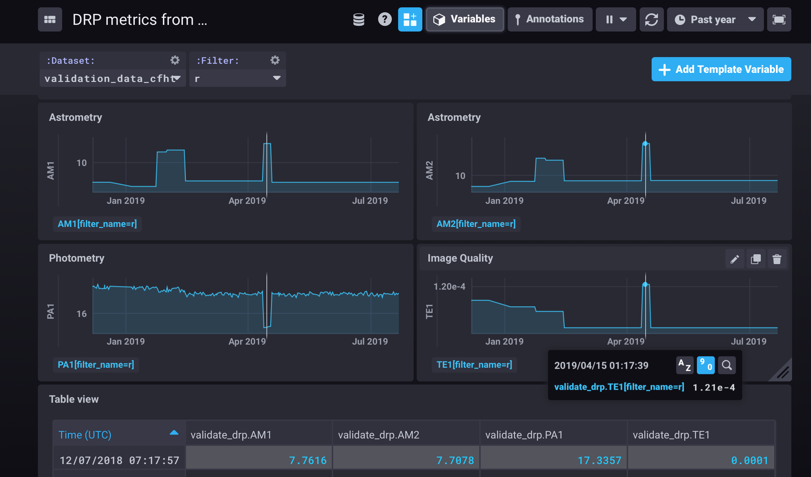

..
  Technote content.

  See https://developer.lsst.io/restructuredtext/style.html
  for a guide to reStructuredText writing.

  Do not put the title, authors or other metadata in this document;
  those are automatically added.

  Use the following syntax for sections:

  Sections
  ========

  and

  Subsections
  -----------

  and

  Subsubsections
  ^^^^^^^^^^^^^^

  To add images, add the image file (png, svg or jpeg preferred) to the
  _static/ directory. The reST syntax for adding the image is

  .. figure:: /_static/filename.ext
     :name: fig-label

     Caption text.

   Run: ``make html`` and ``open _build/html/index.html`` to preview your work.
   See the README at https://github.com/lsst-sqre/lsst-technote-bootstrap or
   this repo's README for more info.

   Feel free to delete this instructional comment.

:tocdepth: 1

.. Please do not modify tocdepth; will be fixed when a new Sphinx theme is shipped.

.. sectnum::

.. TODO: Delete the note below before merging new content to the master branch.

.. note::

   **This technote is not yet published.**

   A description of services that support quality control activities in LSST Data Management. 

.. Add content here.
.. Do not include the document title (it's automatically added from metadata.yaml).

About this document
===================

This document is intended to provide a descriptive overview of the various automated system and processes in use at LSST to support quality control activities. These tools were developed early in Construction by the Science Quality and Reliability Engineering team (SQuaRE) to support Data Management development activities but are now maturing systems in production that are well placed to support observatory operations in the future.

The purpose of this document is to give a tour of these systems and their future development roadmap without descending into too much technical detail; pointers are given to technotes and other documentation for readers wishing to learn more about the functionality and implementation of the services discussed.

Outside the scope of this document are the science-driven quality analysis activities of the Science Pipelines groups, which are complementary to these tools but are aimed at developing the insights to support algorithmic development and science operations (though some of the latter can be captured in these automated systems in the future).

Also outside the scope of this document is the DM Developer Guide, a document that is critical to understanding the Data Management software development process which is of course also a key component to ensure quality of the extensive codebase we are developing. We will, however, discuss services that are in support of that software development.

Not discussed here but part of the overall Data Management strategy is the centralised logging framework that allows us to monitor and debug deployed distributed services.

Finally, in the list of quality control activities not discussed here is the test plan infrastructure for formal system verification, though again some of the systems described here can be used to support the routine execution of some activities.

A narrative overview
====================

Let's walk through a "day in the life" example that calls out the various systems under discussion and provides context for how they come together to support the activities set out in the LSST Data Quality Assurance Plan (LSE-63). We will use the Science Pipelines codebase an an example as it provides the richest example of use of these services, but most of these are relevant to the whole of Data Management and increasingly, beyond. We will also use python code workflows for our examples as that forms the majority of our codebase and python skills can be assumed of all LSST developers and scientists. 

At LSST Data Management we develop code using the git version control systems hosted on the Github repository management service. As Science Pipeline developers work on their various software packages they commit code on branches; our story begins when they are ready to release their feature by merging onto the master branch.

The first system to kick in is a lightweight continuous integration process to lint the code and check that the code is consistent with our language style guide (ref: dev guide) in order to allow code reviewers to focus on substantive code development issues rather than machine-checkable properties of the code (such as the ones described in the python PEP guide). This process is fairly generic and we use an off-the-shelf continuous integration (hereafter CI) service for this purpose (currently Travis CI).

Continuous Integration
----------------------

Because the LSST Science Pipelines (informally and hereafter referred to as "the Stack") is a complex codebase with mixed python and C++ code built by an in-house system, off-the-shelf CI service are not a good match. We therefore have our own CI deployment backed by Jenkins. Jenkins jobs trigger build that compile the code (if appropriate) and run package unit tests supplied by developers, per software engineering best practice. Developers are notified on our chat system (Slack) if their build fails. As well as running on demand for developers, Jenkins also kicks off daily and weekly automated builds as well as official release minting runs. From a technical point of view these are largely identical, but weeklies are more extensively tested than dailies, and official (aka "stable") releases more so than weeklies, as developer turn-around time is less important in those scenarios and more care can (and should) be taken. We typically refer to daily and weekly as "engineering" releases but they are made available to production systems just like the stable releases. The main difference between stable and engineering releases is documentation, more extensive OS testing and an actively release-managed codebase branch.

After the typical build-and-unit-test has passed for an individual package, a docker container is built and published with a coherent and complete version of the entire Stack. Integration and end-to-end tests are then run in this container using test datasets (typically from precursor instruments such as HSC, CFHT or DECAM), thus ensuring that the system is well-characterised before being made available to the production clusters. For the Science Pipelines these tests can result in the calculation of metrics. These can either be official ("key") metrics that have been identified as high-level performance indicators of the data processing (ref) or any metric of interest that a developer has an interest in tracking.

The docker containers built at the end of this process are further used as the basis of additional services; for example the containers for the Notebook Aspect of the Science Platform are built on top of the Science Pipelines containers, thus ensurring they inherit a well-tested state. 

Verification Framework
----------------------

We have defined a metrics verification framework with an API for dispatching the results to our metrics curation infrastructure. Metrics (which are any scalar quantity that can be calculated and which we wish track) have a definition specified in YAML. Here is an example of the definition for the key metric AM1:

.. code-block:: yaml

	AM1:
	description: >
	  The maximum rms of the astrometric distance distribution for stellar pairs with separations of D=5 arcmin (repeatability).
	unit: marcsec
	reference:
	  doc: LPM-17
	  url: http://ls.st/lpm-17
	  page: 23
	tags: astrometry

A metric specification defines a test of metric measurement. Here is an example showing how one specifies a test that that compares a computed value for the AM1 metric with two thresholds, a design goal (10 milliarcseconds) and a minimum requirement (20 milliarcseconds). This examples also demonstrates the inheritance supported by the framework to aid developers in writing concise specifications. 

.. code-block:: yaml

	# Specification partial
	id: 'AM1-base-srd'
	metric: 'AM1'
	tags:
	  - 'AM1'
	  - 'achromatic'
	threshold:
	  unit: 'milliarcsecond'
	  operator: "<="				

	---
	name: "design"
	base: "#AM1-base-srd"
	threshold:
	  value: 10.0
	tags:
	  - design

	---
	name: "minimum"
	base: "#AM1-base-srd"
	threshold:
	  value: 20.0
	tags:
	  - minimum

	---

This flexible and extensible framework (described in more detail in `SQR-019 <https://sqr-019.lsst.io>`_ ) significantly lowers the barrier to allow developers to easily add and track algorithmic and scientific metrics. Production system engineers can also specify metrics relating to non-algorithmic quantities, such as execution time or memory usage. Instrumenting our code to produce metrics that are dispatched to our centralised metric curation service (described below) is a central part of our strategy for ensuring on an automated ongoing basis that everything is functioning as expected and that there are no regressions in performance. 

Metrics curation and monitoring (Squash)
----------------------------------------

Calculating metrics is all very well and good, but in order to make use of them we need to monitor them and make them available for analysis. Historically we envisaged a single web application (based on Django) for both of these functions, our in-house Science Quality Analysis Harness (Squash). With the advent of nublado, our Jupyterlab-based notebook aspect of the LSST Science Platform (`sqr-018 <https://sqr-018.lsst.io>`_), we have restricted Squash to backend functions such as providing metrics curation APIs, storing metrics in the high-performance time-series database InfluxDB and are exposing data to off-the-shelf systems for scalar visualisation and monitoring (such as Chronograf, Grafana and Kapacitor). These allow us to perform short and long term trend analysis and issue alerts when there are metrics excursions.

A further description of Squash and an explanatio of our metric curation architecture can be found in `sqr-009 <https://sqr-009.lsst.io>`_

Automated notebook execution
----------------------------

For more analytic flows, especially once that correlate metrics values with astronomical data derived quantities or facility properties, it is clear that notebooks provide a superior environment for developing deep dive interactive analyses for quantities of interest. (example)

However we don't wish to surrender the great value that there is in continuous monitoring without human intervention. We are therefore developing a harness for automated notebook execution and publication of data or reports from them. This also permits the automated publication of quality reports, such as Stack characterisation reports that accompany official software releases. The automated notebook-based publication system is described in (ref: sqr-029). 

Microservices architecture
--------------------------

There are some situations in which the ubiquitous scenario of metric measurement -> deviation -> alert is insufficient. This can be because an alert may be necessary due to compound metrics from heterogenous systems, or require follow-up processing, or need a behaviour (eg such as paging specific individuals) that needs fine tuning to avoid swamping staff with false positives. Partly for this purpose we are developing a kafka-based microservices arhitecture that allows more sophisticated heuristics to be applied and/or more complex actions to be taken as a result of quality control events. 

Looking forward to Operations
=============================

While the systems and processes described here are in production right now supporting software development, this ecosystem has been designed from the start to adapt to the needs of Commissioning and Operations. While in development we have static test datasets and rapidly changing code, in operations we have slower changing code with constantly changing datasets, but the principles remain the same: allow scientists and engineers to be confident the observatory is well monitored with systems that safeguard as much as possible against unintended behaviour making its way into production. 

.. .. rubric:: References

.. Make in-text citations with: :cite:`bibkey`.

.. .. bibliography:: local.bib lsstbib/books.bib lsstbib/lsst.bib lsstbib/lsst-dm.bib lsstbib/refs.bib lsstbib/refs_ads.bib
..    :style: lsst_aa
